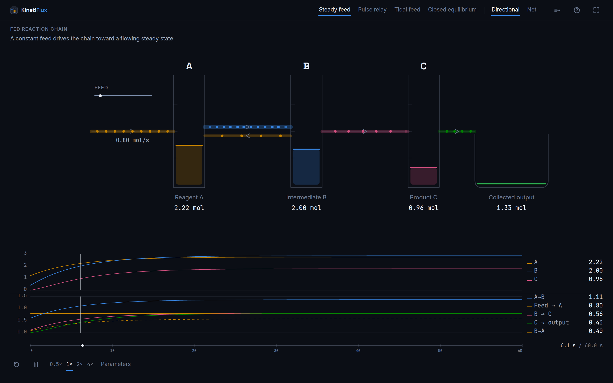
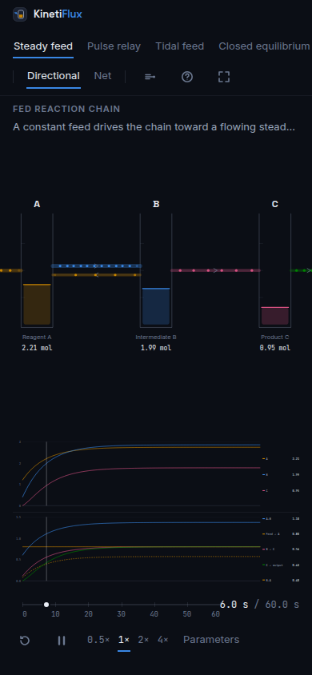

<p align="center">
  
</p>

# KinetiFlux

Interactive reaction-kinetics and dynamic-flow visualization — watch quantities, rates, flows,
and collected output move through a dynamic model.

[](https://github.com/yktsnd/kinetiflux/actions/workflows/ci.yml)
[](https://github.com/yktsnd/kinetiflux/actions/workflows/deploy.yml)
[](./LICENSE)



**[Live demo](https://yktsnd.github.io/kinetiflux/)** — deploys automatically from `main` via
GitHub Pages.

## What it does

- An animated network view driven by a real ODE solution — not a canned animation.
- Four curated presets showing distinct dynamic regimes (steady feed, a pulse relay, a tidal
  feed, and a closed equilibrium).
- Synchronized quantity and rate charts sharing one time cursor with the network view.
- A directional view (separate forward/reverse lanes) and a net view (one signed lane) for
  reversible processes.
- A parameters drawer with instant recomputation — every change re-integrates the whole
  trajectory synchronously.
- An exhibition (kiosk) mode: fullscreen, auto-advancing through presets with scene-transition
  captions, for unattended display.
- Full reduced-motion support, independent of and overriding the OS preference.
- A deterministic, fixed-step RK4 numerical core with tested invariants (see
  [`AGENTS.md`](./AGENTS.md#numerical-invariants)).

## How to read it

- **Fill height** of a vessel = quantity, linear against its display capacity.
- **Channel width** = instantaneous rate, on a square-root scale so rendered area tracks rate.
- **Particle frequency** = amount actually moved (integrated rate through a fixed quantum) — not
  particle speed, which is a fixed wall-clock travel time and carries no rate meaning.
- **Direction** = chevrons plus particle travel direction, backed by offset lanes for reversible
  processes in directional view.
- **Basin fill** = cumulative collected output; it only ever rises.
- **Charts** plot the same trajectory the network view renders from — never a separate
  computation.

Full encoding reference: [`docs/visual-language.md`](docs/visual-language.md).



## Quick start

```
git clone https://github.com/yktsnd/kinetiflux.git
cd kinetiflux
npm install
npm run dev
```

## Development commands

| Task                   | Command                                                                    |
| ---------------------- | -------------------------------------------------------------------------- |
| Install                | `npm install` (CI: `npm ci`)                                               |
| Develop                | `npm run dev`                                                              |
| Unit + numerical tests | `npm test`                                                                 |
| Watch tests            | `npm run test:watch`                                                       |
| E2E tests              | `npx playwright install chromium` once, then `npm run test:e2e`            |
| Lint                   | `npm run lint`                                                             |
| Type check             | `npm run typecheck`                                                        |
| Format                 | `npm run format` (check: `npm run format:check`)                           |
| Production build       | `npm run build`                                                            |
| Preview build          | `npm run preview`                                                          |
| **Full validation**    | **`npm run check`** (format check → lint → typecheck → unit tests → build) |

## Architecture, briefly

A model definition (species, processes, parameters, an input profile) is compiled into an ODE
system and integrated once with fixed-step RK4 into an immutable trajectory. Playback and
scrubbing only ever select a time within that trajectory — they never recompute it. Every view
(the animated network, both charts, the readouts) renders from that same trajectory object, so
nothing on screen can disagree with anything else. Model and solver code are plain TypeScript
with no React or DOM dependency.

Full detail, with a data-flow diagram: [`docs/architecture.md`](docs/architecture.md). Repository
map and standard commands: [`AGENTS.md`](./AGENTS.md).

## Roadmap

- A model gallery and shareable parameter URLs.
- More rate laws beyond first-order mass action.
- Chart data table export.
- A second theme, only if it can match the current theme's quality.

## Contributing

See [`CONTRIBUTING.md`](./CONTRIBUTING.md) for local setup, branch/PR expectations, and
design/numerical change requirements. Participation is governed by the
[`CODE_OF_CONDUCT.md`](./CODE_OF_CONDUCT.md).

## License

[MIT](./LICENSE)

## Acknowledgements

- Code of Conduct adapted from the [Contributor Covenant](https://www.contributor-covenant.org/).
- Typefaces: [Inter](https://fontsource.org/fonts/inter), [Space Grotesk](https://fontsource.org/fonts/space-grotesk),
  and [JetBrains Mono](https://fontsource.org/fonts/jetbrains-mono), via [Fontsource](https://fontsource.org/).
