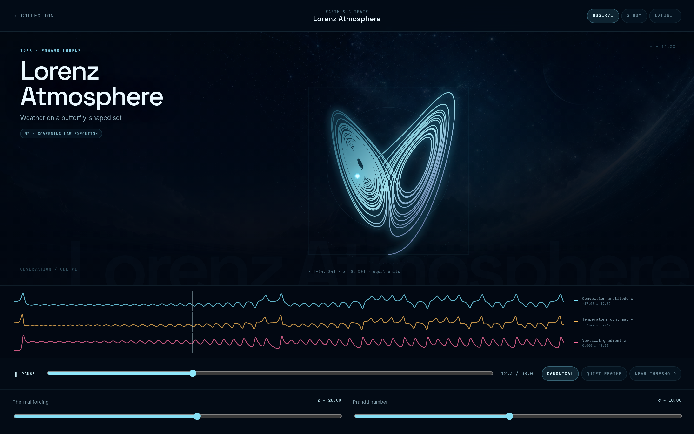
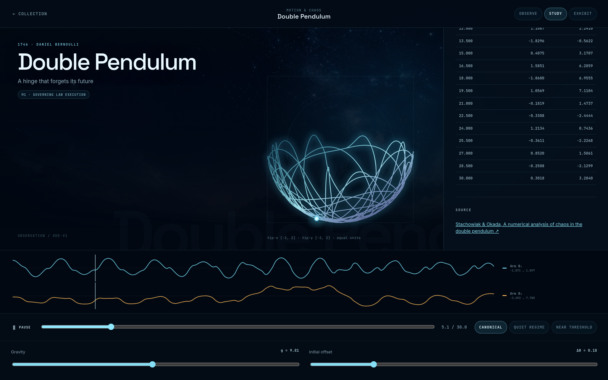
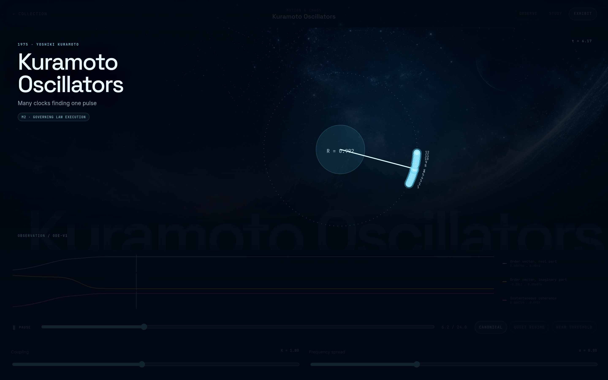
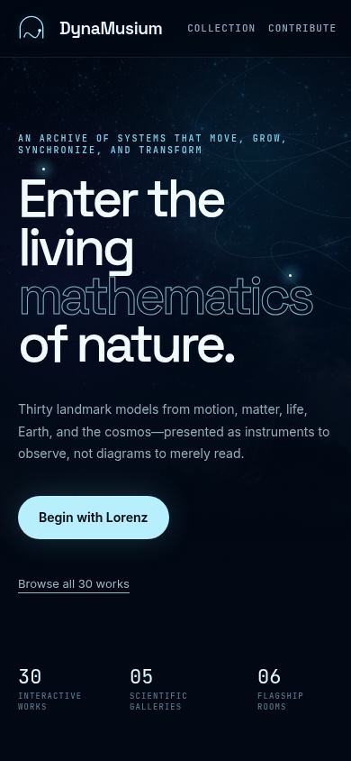

<div align="center">
  

# DynaMusium

**Museum of Dynamic Systems**

Thirty interactive mathematical models across motion, matter, life, Earth, and the cosmos.

**[Open the live museum →](https://yktsnd.github.io/dynamusium/)**
</div>



DynaMusium treats a scientific model as a cultural object: something to observe, operate,
question, source, and preserve. Every work is computed in the browser and connects its
trajectory or spatial field to live controls, synchronized traces, equations, citations, and
numerical evidence.

The collection is built on a **Dynamical Portrait** contract. A kernel first produces raw
numerical state, provenance, and checks. Capability-gated analyzers may then identify finite,
scientifically qualified objects. Reviewed semantic mappings bind those objects to position,
density, width, direction, color, or time. The final composition may change light, typography,
camera, pacing, and negative space, but it cannot change what a visual channel means:

```text
formal dynamical system
  -> numerical result + provenance
  -> scientific objects + evidence
  -> immutable semantic visual mappings
  -> renderer-agnostic museum composition
```

This is an implementation framework assembled from established mathematics, not a claim to
classify every dynamical system. No proprietary authoring tool is required or privileged. Fable,
if used by an individual contributor, can supply composition choices only; the scientific
mappings remain owned and validated by DynaMusium.

## The collection


| Gallery          | Works                                                                                                |
| ---------------- | ---------------------------------------------------------------------------------------------------- |
| Motion & Chaos   | Double Pendulum, Kuramoto Oscillators, FPUT Chain, Logistic Map, Wave Equation, Standard Map         |
| Matter & Pattern | Fed Reaction Chain, Gray–Scott, Heat/Diffusion, Schrödinger Wave Packet, Ising Model, Cahn–Hilliard  |
| Life & Reaction  | Lotka–Volterra, Brusselator, Oregonator, SIR, Hodgkin–Huxley, FitzHugh–Nagumo                        |
| Earth & Climate  | Lorenz Atmosphere, Stommel Box, Daisyworld, Carbon Cycle, Shallow-Water, Budyko–Sellers              |
| Cosmos & Gravity | Restricted Three-Body, Kepler Orbit, Hohmann Transfer, N-Body, Friedmann–Lemaître, Exoplanet Transit |

The first six are flagship rooms with a deliberately cinematic observation mode. The other
twenty-four use the same museum-grade interaction, provenance, and accessibility contract.
Each work also declares whether it executes a governing law, a closed-form solution, a reduced
model, data-derived dynamics, or an illustrative surrogate. That representation label is kept
separate from its attained evidence maturity (`M0`–`M4`).

## Run locally

```bash
git clone https://github.com/yktsnd/dynamusium.git
cd dynamusium
npm ci
npm run dev
```

Validation:

```bash
npm run check
npm run test:e2e
npm run work:validate
```

The application is static, client-only, and deploys to GitHub Pages. It has no account,
backend, analytics, upload surface, or persistent storage.

## Add a work

```bash
npm run work:new -- rossler-attractor "Rössler Attractor"
```

This creates a version-2 JSON manifest under `src/works/community/`. Complete its formal class,
scientific claim, representation, evidence plan, semantic visual mappings, and curatorial metadata;
register or reuse a deterministic or explicitly seeded kernel; then run `npm run work:validate`
and the test suite.
There is no central hand-maintained list of community manifest paths: JSON files are discovered at
build time. Executable kernels and reviewed built-in portrait definitions remain explicit typed
registries; manifest discovery never loads arbitrary code. See
[CONTRIBUTING_WORKS.md](./CONTRIBUTING_WORKS.md) for the full contract.

## Architecture

- `src/museum/portrait-types.ts` — formal class, representation, evidence, provenance, scientific
  object, semantic mapping, and composition contracts.
- `src/museum/execute-work.ts` — the valid/invalid run boundary and portrait assembly.
- `src/museum/runtimes/` — reviewed ODE, symplectic, stochastic, field, and analytic kernels.
- `src/museum/analyzers.ts` — live capability adapters for finite recurrence / occupancy,
  identity-dictionary ridge EDMD with chronological holdout, observed box transitions, finite-grid
  H0 persistence, and interface evidence.
- `src/museum/advanced-analyzers.ts` — bounded authoring / build-time APIs for finite-precision
  pseudo-arclength continuation, explicit-dictionary EDMD, finite-grid H0 persistence, and supplied
  finite transition enclosures. Fold detections and spectral / topology outputs remain qualified
  numerical artifacts, not proof-strength claims. Finite-enclosure evidence and any external index
  certificate carry a source reference and lowercase SHA-256 content hash.
- `src/museum/catalog.ts` — the thirty-work permanent collection and dynamic manifest discovery.
- `src/museum/MuseumApp.tsx` — Entrance, Collection, Observe, Study, and Exhibit experiences.
- `src/works/work-v2.schema.json` — preferred Dynamical Portrait contribution contract;
  `work.schema.json` preserves strict version-1 compatibility.
- `src/model/`, `src/solver/`, `src/state/` — the preserved, rigorously tested reaction-network core.



Study mode is where the evidence lives: the model's equation, its Dynamical Portrait maturity
rating, numerical provenance (kernel, integrator, tolerances), the hard checks and claim
assessments behind that rating, the visual-encoding bindings, a live sampled data table, and the
source citation — all scrollable alongside the running artwork.

Scientific time comes only from the computed samples. Exhibit pacing uses a separate
wall-clock `presentationDuration`, so cinematic dwell never changes a physical frequency,
decay rate, or flux. The visual atmosphere never encodes scientific values: data color,
position, trace, and motion derive from the run, while the cosmic/deep-ocean environment stays
a separate, decorative layer.

The implementation retains the existing museum screen, quiet motion, deep-ink palette, and
Observe / Study / Exhibit experience. In Exhibit mode the header, controls, and traces recede to
near-invisible until hovered, leaving only the running artwork and its title on screen; the layout
also collapses to a single column down to phone width.

<table>
<tr>
<td width="65%">



</td>
<td>



</td>
</tr>
</table>

See [the architecture](./docs/architecture.md),
[model contract](./docs/model-contract.md), [numerical policy](./docs/numerical-method.md), and
[visual language](./docs/visual-language.md) for the enforceable boundaries. The
[Dynamical Portrait foundation](./docs/dynamical-portrait-foundation.md) preserves the 1412542
baseline audit, compares the established mathematics, and records which roadmap capabilities were
implemented directly or differently, and which theorem-strength claims require per-work external
reviewed artifacts rather than a generic browser analyzer.

## License

Code and original museum copy are released under the [MIT License](./LICENSE). Equations are
facts; citations identify the historical or canonical sources used to define each work. No
third-party stock imagery is distributed with the museum.
