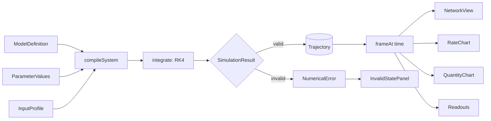

# Architecture

How KinetiFlux gets from a model definition to an animated, scrubbable view.
For the module-by-module repository map, see [AGENTS.md](../AGENTS.md#repository-map) —
this document does not repeat it.

## Data flow

A model definition, the current parameter values, and an input profile are
compiled into an ODE system and integrated once into a typed
`SimulationResult` (`src/solver/simulation-result.ts`) — either a `valid`
result carrying an immutable `Trajectory`, or an `invalid` result carrying a
`NumericalError`, in both cases alongside `Diagnostics`. The store applies
that result: on `valid`, every view — the network, both charts, and the
readouts — reads from the same `Trajectory` object, and playback only selects
a time within it; on `invalid`, there is no trajectory, playback halts, and
the UI renders the failure instead of the network and charts (see "Invalid
results" below).

## State ownership

The Zustand store (`src/state/simulation-store.ts`) is the sole owner of
application state. It holds:

- the active `model`, `presetId`, `params`, `profile`, `initialOverrides`;
- the result of the last `integrate()` call, split into `status` (`'valid' |
'invalid'`), `trajectory: Trajectory | null` (non-null only when `status
=== 'valid'`), `error: NumericalError | null` (non-null only when `status
=== 'invalid'`), and `diagnostics` — the only place a `SimulationResult` is
  produced or unpacked;
- playback state (`time`, `playing`, `speed`);
- interaction state (`selection`, `rateView`, `hoverTime`, panel toggles,
  `reducedMotionOverride`).

The result is recomputed synchronously, in the same store action, whenever
`params`, `profile`, `initialOverrides`, or the preset change, and applied via
`applyResult`. Nothing else in the app calls `integrate()`. Playback time
(`time`) is never anything but an index into the current trajectory when one
exists — advancing it, scrubbing it, or hovering it never touches
`trajectory` itself.

## Invalid results

When `applyResult` receives an `invalid` `SimulationResult`, it sets
`status: 'invalid'`, `trajectory: null`, `error` to the `NumericalError`,
`playing: false`, and `time: 0`. Every playback action (`play`, `restart`,
`setTime`, `advance`) reads `trajectory` first and no-ops if it is `null`, so
there is no way to nudge the store into "playing" a run that failed. `App`
(`src/app/App.tsx`) branches on `status === 'valid'`: when invalid, it renders
`InvalidStatePanel` (`role="alert"`, the error's message and diagnostic
details, and a "Reset preset defaults" button) in place of `NetworkView`,
hides `TransportBar`, and replaces `QuantityChart`/`RateChart` with
"unavailable" placeholders. `StatusAnnouncer` also switches to announcing the
failure for screen-reader users (see [accessibility.md](./accessibility.md)).
The only paths back to a valid state are `resetToPresetDefaults()` (which
re-selects the current preset) or changing an input to a value that produces
a valid result.

Selectors in `src/state/selectors.ts` (`selectCurrentFrame`,
`selectHoverFrame`, `selectReadoutFrame`) derive a single `Frame` via
`frameAt(trajectory, time)`. All on-screen numbers for a given instant come
from one `Frame`, so a chart's readout row and the network's vessel labels
never disagree.

## Update lifecycle after a parameter change

1. A control (inspector slider, profile field, preset switch) calls a store
   action such as `setParam(id, value)`.
2. The action clamps the value to the parameter's declared `[min, max]`
   (`clampParameterValue` in `src/model/validation.ts`).
3. The action calls `computeResult`, which calls `integrate()` — this runs the
   full fixed-step RK4 pass synchronously and returns a brand-new
   `SimulationResult` (new `Float64Array`s throughout when valid; nothing is
   mutated in place).
4. `applyResult` maps that `SimulationResult` onto store fields: if valid, it
   replaces `trajectory` (and, for `setParam`, clamps `time` to the new
   `trajectory.duration` so playback never points past the end of the new
   run); if invalid, it clears `trajectory`, sets `error`, stops playback, and
   resets `time` to `0` (see "Invalid results" above). Either way `set()`
   applies the whole result in one call.
5. Zustand notifies subscribers; every component reading `status`,
   `trajectory`, `error`, or a frame derived from `trajectory` re-renders from
   the new state. There is no diffing between old and new results — each is a
   complete, independent outcome.

Because the result is replaced wholesale rather than patched, there is no
window where the network shows one parameter set and a chart shows another,
and no window where part of the UI still shows a trajectory from before a run
that just failed.

## Playback and scrubbing

Playback is driven by `usePlaybackLoop` (`src/features/playback/usePlaybackLoop.ts`),
a `requestAnimationFrame` loop that calls `advance(dtWall)` every frame. `advance`
computes `time + dtWall * speed`, clamping to `trajectory.duration` and
stopping playback at the end. `advance` never recomputes the trajectory —
changing `speed` changes how fast `time` moves through the existing curve,
not the curve itself.

Scrubbing (dragging the range input, or pointer interaction on a chart via
`useSharedCursor` in `src/charts/shared-cursor.ts`) calls `setTime(t)`
directly. `setTime` only clamps `t` to `[0, trajectory.duration]` and writes
it to the store — it is a pure jump, never a recomputation.

The particle layer (`src/visualization/particles/ParticleLayer.tsx`) reacts to
these jumps: each render tick it compares the current sim time to the last
one it saw. If the delta is negative (scrubbed backward) or exceeds
`SCRUB_RESET_THRESHOLD` (0.5 simulated seconds, `src/design-system/motion.ts`),
every lane's in-flight particles and pending emission accumulator are cleared
(`resetLane`) instead of being fast-forwarded or replayed — a scrub never
produces a burst of particles representing time it didn't actually animate
through. The same reset happens when the trajectory object itself changes
(new params/profile/preset) or `rateView` toggles.

## Exhibition (kiosk) mode

`src/features/exhibition/` is a thin presentation layer for unattended,
kiosk-style display, built entirely on top of the existing playback loop and
store — it introduces no second source of simulated state. `useExhibition`
(`src/features/exhibition/useExhibition.ts`) owns `exhibitMode` (a store
boolean toggled by a rail button, the "e" key, or the `?exhibit=1` URL
param), best-effort fullscreen, and two independent behaviors:

- **Auto-advance**: when a trajectory finishes playing while exhibition mode
  is on, the hook holds the final frame, fades the field out, then calls
  `selectPreset(next.id)` — the same store action `PresetSwitcher` calls on a
  user click — to move to the next preset (cyclic through `presets`), shows
  that preset's caption prominently, then fades back in. Auto-advance never
  bypasses `computeResult`/`applyResult`; every frame it displays, including
  during the transition, is the output of a real `integrate()` call.
- **UI recession**: after a period with no `pointermove`/`keydown`/`focusin`,
  the hook sets a `uiRecessed` flag that a CSS class scheme
  (`exhibition.css`) uses to fade the rail, transport, and axis chrome to
  `opacity: 0`, keeping only the caption and trace-strip readout columns
  faintly visible.

Both behaviors are driven purely by CSS classes on the app root
(`is-exhibit`, `is-recessed`, `is-field-hidden`) and store subscriptions —
`usePlaybackLoop` and `integrate()` are untouched by exhibition mode. See
[docs/visual-language.md](./visual-language.md) for how the fades and the
prominent caption render, and
[docs/accessibility.md](./accessibility.md#exhibition-mode) for the
reduced-motion and focus behavior of UI recession.

## See also

- [docs/model-contract.md](./model-contract.md) — the typed interfaces this flow is built on.
- [docs/numerical-method.md](./numerical-method.md) — what `integrate()` actually does.
- [docs/visual-language.md](./visual-language.md) — how a `Frame` becomes pixels.
