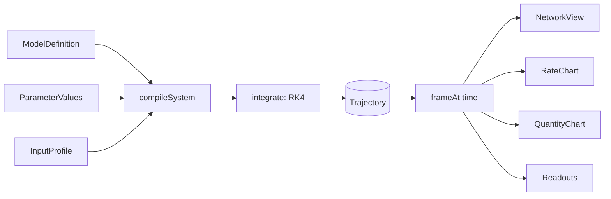

# Architecture

How KinetiFlux gets from a model definition to an animated, scrubbable view.
For the module-by-module repository map, see [AGENTS.md](../AGENTS.md#repository-map) —
this document does not repeat it.

## Data flow

A model definition, the current parameter values, and an input profile are
compiled into an ODE system and integrated once into an immutable
`Trajectory`. Every view — the network, both charts, and the readouts — reads
from that same object; playback only selects a time within it.

## State ownership

The Zustand store (`src/state/simulation-store.ts`) is the sole owner of
application state. It holds:

- the active `model`, `presetId`, `params`, `profile`, `initialOverrides`;
- the computed `trajectory` — the only place a `Trajectory` is produced;
- playback state (`time`, `playing`, `speed`);
- interaction state (`selection`, `rateView`, `hoverTime`, panel toggles,
  `reducedMotionOverride`).

`trajectory` is recomputed synchronously, in the same store action, whenever
`params`, `profile`, `initialOverrides`, or the preset change. Nothing else
in the app calls `integrate()`. Playback time (`time`) is never anything but
an index into the current trajectory — advancing it, scrubbing it, or hovering
it never touches `trajectory` itself.

Selectors in `src/state/selectors.ts` (`selectCurrentFrame`,
`selectHoverFrame`, `selectReadoutFrame`) derive a single `Frame` via
`frameAt(trajectory, time)`. All on-screen numbers for a given instant come
from one `Frame`, so a chart's readout row and the network's vessel labels
never disagree.

## Update lifecycle after a parameter change

1. A control (inspector slider, profile field, preset switch) calls a store
   action such as `setParam(id, value)`.
2. The action clamps the value to the parameter's declared `[min, max]`
   (`clampParameterValue` in `src/model/validation.ts`).
3. The action calls `computeTrajectory`, which calls `integrate()` — this
   runs the full fixed-step RK4 pass synchronously and returns a brand-new
   `Trajectory` object (new `Float64Array`s throughout; nothing is mutated in
   place).
4. The store's `set()` replaces `trajectory` (and, for `setParam`, clamps
   `time` to the new `trajectory.duration` so playback never points past the
   end of the new run).
5. Zustand notifies subscribers; every component reading `trajectory` or a
   frame derived from it re-renders from the new object. There is no diffing
   between old and new trajectories — each is a complete, independent result.

Because the trajectory is replaced wholesale rather than patched, there is no
window where the network shows one parameter set and a chart shows another.

## Playback and scrubbing

Playback is driven by `usePlaybackLoop` (`src/features/playback/usePlaybackLoop.ts`),
a `requestAnimationFrame` loop that calls `advance(dtWall)` every frame. `advance`
computes `time + dtWall * speed`, clamping to `trajectory.duration` and
stopping playback at the end. `advance` never recomputes the trajectory —
changing `speed` changes how fast `time` moves through the existing curve,
not the curve itself.

Scrubbing (dragging the range input, or pointer interaction on a chart via
`useSharedCursor` in `src/charts/shared-cursor.ts`) calls `setTime(t)`
directly. `setTime` only clamps `t` to `[0, trajectory.duration]` and writes
it to the store — it is a pure jump, never a recomputation.

The particle layer (`src/visualization/particles/ParticleLayer.tsx`) reacts to
these jumps: each render tick it compares the current sim time to the last
one it saw. If the delta is negative (scrubbed backward) or exceeds
`SCRUB_RESET_THRESHOLD` (0.5 simulated seconds, `src/design-system/motion.ts`),
every lane's in-flight particles and pending emission accumulator are cleared
(`resetLane`) instead of being fast-forwarded or replayed — a scrub never
produces a burst of particles representing time it didn't actually animate
through. The same reset happens when the trajectory object itself changes
(new params/profile/preset) or `rateView` toggles.

## See also

- [docs/model-contract.md](./model-contract.md) — the typed interfaces this flow is built on.
- [docs/numerical-method.md](./numerical-method.md) — what `integrate()` actually does.
- [docs/visual-language.md](./visual-language.md) — how a `Frame` becomes pixels.
